# coils-for-new-landreman

Coils, optimized with [ESSOS](https://github.com/uwplasma/ESSOS), for the explicit
non-axisymmetric MHD equilibria of [Landreman, arXiv:2609.26742](https://arxiv.org/abs/2609.26742),
and a check that they hold those equilibria.

The paper gives two families of smooth equilibria with exact nested flux surfaces in closed form:
one with rotational transform ι = 2, and one with sheared ι. Both have two field periods,
stellarator symmetry, finite pressure and net toroidal current. Here both families are written in
JAX, so the equilibrium and all its derivatives are known exactly. Virtual casing turns that
solution into the field the coils must produce. Coils are optimized for it with weighted penalties
or an augmented Lagrangian, then checked against VMEX and by field-line tracing.

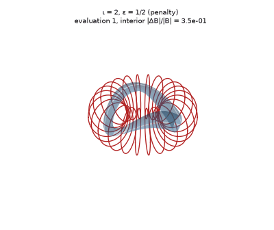 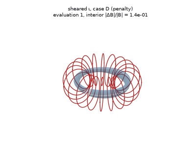

## Usage

```bash
pip install -r requirements.txt
python optimize_coils_iota2.py                              # ι = 2, weighted penalties
python optimize_coils_iota2_augmented_lagrangian.py         # ι = 2, augmented Lagrangian
python optimize_coils_sheared_iota.py                       # sheared ι, CASE = "A", "B", "D" or "E"
python optimize_coils_sheared_iota_augmented_lagrangian.py  # sheared ι, augmented Lagrangian
python scan_coils.py                                        # coil count / curvature / length / loop-cap scan
python benchmark_vmex.py                                    # fixed- and free-boundary VMEX vs the analytic solution
python validate_fieldlines.py                               # field lines with the coils vs the analytic surfaces
pytest -q                                                   # machine-precision checks of the equilibria
```

Every script runs on its own and prints its progress. The optimizations write
`coils_<case>.json` (ESSOS coils), `coils_<case>.png` (coils on the boundary coloured by the
B·n error, plus convergence) and `coils_<case>.gif` (the optimization).

| file | content |
| --- | --- |
| `landreman_equilibria.py` | both families in JAX, the cases, the exact boundary, the exact interior coil field, the boundary target |
| `coil_optimization.py` | targets, objective terms, constraints, penalty optimizer, report, figure and movie |
| `optimize_coils_*.py` | one script per family and method |
| `scan_coils.py` | parameter scans (`scan_results.json`, `scan.png`, `scan_loop_cap.png`) |
| `benchmark_vmex.py` | VMEX benchmark (`benchmark_D.png`, `benchmark_results.json`) |
| `validate_fieldlines.py` | field-line check of the coils (`fieldlines_D.png`) |
| `tests/test_equilibria.py` | div B = 0, J × B = ∇p, B·∇ψ = 0, B·n = 0 on the boundary, ι(0) from the paper, vacuum coil field |

## Equilibria

| case | parameters | ι axis → edge | \|B\|max/\|B\|min on boundary | note |
| --- | --- | --- | --- | --- |
| ι = 2 | ε = 1/2, ψ_edge = 1/64 (paper fig. 1) | 2 | 1.6 | non-planar axis, closed field lines |
| sheared A | ε, S, k_b, λ = 1.08, 3, 0.7, 3.5 (paper fig. 2) | 5.69 → | 1.6 | nearly circular axis |
| sheared B | 4, 3.5, 0.7, 3.5 (paper fig. 2) | 4.36 → | 5.4 | not reproducible by coils |
| sheared D | 1, 2, 0.5, 3.5 (new) | 3.88 → 3.98 | 1.6 | elliptical axis, b/a = 1.28 |
| sheared E | 1, 1.75, 0.5, 3.5 (new) | 3.43 → 3.49 | 1.7 | like D, ι away from the ι = 4 resonance |

All cases are scaled to a 1 m mean axis radius and 1 T on the axis.

The sheared family is built on confocal ellipses whose foci, (x, y) = (0, ±√ε), are singularities
of the field. In paper cases B and C the foci lie about 0.2 m inside the plasma's outer edge, and
|B| on the boundary varies 5–12×. No coil set tried for B gets below 5% mean B·n error. Cases D
and E were found by scanning (ε, S, k_b, λ) for parameters that keep the foci away from the plasma
while keeping an elliptical axis and sheared ι.

## Method

**Exact coil field.** The plasma carries current, so the coils must reproduce only the field of the
currents outside it, B_coils = B − B_plasma. For points inside the plasma, virtual casing gives it
exactly:

    B_coils(x) = -(1/4π) ∮ (n' × B') × (x - x') / |x - x'|³ dA'

The boundary r(θ, ζ) and B are analytic, so the trapezoidal rule converges exponentially. At half
the minor radius the target is accurate to 2e-15 (sheared cases) and 1.4e-8 (ι = 2). On the
boundary itself the integral is singular. There, the on-surface singular quadrature of
[virtual_casing_jax](https://github.com/uwplasma/virtual_casing_jax) gives all three components.
A 32 × 32 grid at 4 digits is converged to about 1e-6 of |B|.

**Objective.** The coils must match:
- the interior field, which fixes the total coil current;
- the full boundary field: the normal part for B·n = 0, and the tangential part for the pressure
  balance a free-boundary equilibrium needs.

The engineering limits are:
- length ≤ 4 m and curvature ≤ 4 m⁻¹;
- mean squared curvature ≤ 9 m⁻²;
- total curvature ∫κ dl ≤ 3π (each loop adds 2π);
- arclength variation;
- coil–coil distance ≥ 0.12 m and coil–plasma distance ≥ 0.2 m;
- zero linking number.

The coils start as circles, 5 per half period (20 in total), Fourier order 4. For the sheared
cases they are centred on the elliptical axis. All gradients are exact (JAX).

**Methods.**
- *Penalty*: the limits are weighted penalties, minimized with L-BFGS-B (1000 iterations).
- *Augmented Lagrangian*: the field mismatch is the objective and each limit is a constraint,
  max(value − limit, 0) = 0, with its own multiplier (`essos.augmented_lagrangian`). It runs
  10 outer iterations of up to 400 inner L-BFGS-B iterations each.

## Results

| case | method | interior \|ΔB\|/\|B\| mean / max | boundary \|ΔB·n\|/\|B\| mean / max | boundary \|ΔB\|/\|B\| max | max κ (m⁻¹) | time |
| --- | --- | --- | --- | --- | --- | --- |
| ι = 2 | penalty | 3.4e-4 / 9.3e-4 | 6.2e-4 / 4.7e-3 | 6.6e-2 | 4.02 | 94 s |
| ι = 2 | augmented Lagrangian | 2.7e-4 / 8.6e-4 | 5.4e-4 / 4.6e-3 | 6.6e-2 | 4.00 | 430 s |
| sheared A | penalty | 3.9e-3 / 9.8e-3 | 8.7e-3 / 4.8e-2 | 5.1e-2 | 4.56 | 65 s |
| sheared A | augmented Lagrangian | 4.9e-3 / 1.0e-2 | 1.2e-2 / 5.2e-2 | 5.4e-2 | 4.01 | 854 s |
| sheared D | penalty | 1.2e-3 / 2.5e-3 | 3.1e-3 / 9.2e-3 | 9.7e-3 | 4.09 | 62 s |
| sheared D | augmented Lagrangian | 1.2e-3 / 3.0e-3 | 3.2e-3 / 9.7e-3 | 1.0e-2 | 4.00 | 867 s |

| | penalty | augmented Lagrangian |
| --- | --- | --- |
| ι = 2 | 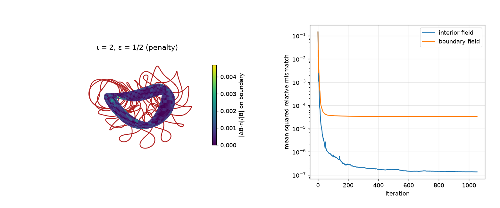 | 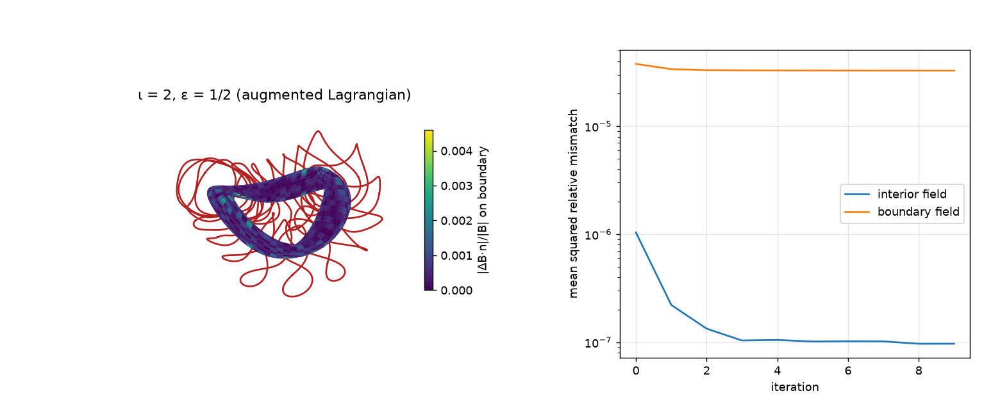 |
| sheared A | 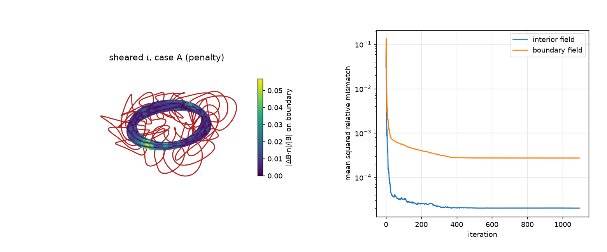 | 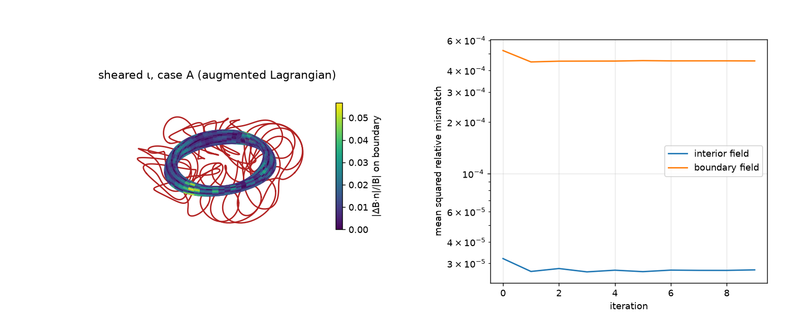 |
| sheared D | 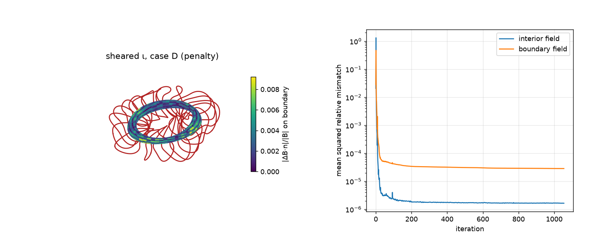 | 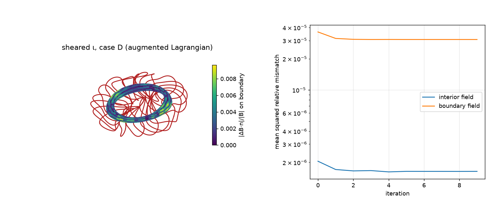 |

Movies of every run: `coils_<case>.gif` and `coils_<case>_al.gif`.

- Case D's coils hold the whole boundary field to 1% with a strongly elliptical axis.
- The augmented Lagrangian meets every limit exactly and matches the penalty field error for ι = 2
  and D. The penalty method gets A slightly better by letting curvature reach 4.56 m⁻¹. The
  augmented Lagrangian takes 5–14× longer.
- For ι = 2, the boundary field error is 6.6% at a few points on the inboard midplane near φ = 0,
  where |B| is highest. This is the same for every coil set. The target there is converged to
  1e-6, so it is a limit of the coils, not of the target.
- Mean coil forces are 1.0–1.8 × 10⁵ N/m. They are reported, not penalized.

## Parameter scan

`scan_coils.py` runs the penalty optimization (500 iterations) for:
- every combination of 3–6 coils per half period, curvature limit 3–5 m⁻¹ and length limit
  3–5 m (108 runs);
- case A with total-curvature caps of 1.25–3·2π.

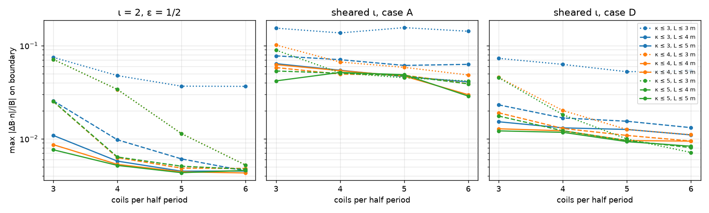

| case | 3 coils | 4 coils | 5 coils | 6 coils |
| --- | --- | --- | --- | --- |
| ι = 2 | 2.5e-2 | 6.3e-3 | 4.8e-3 | 4.8e-3 |
| sheared A | 5.8e-2 | 4.9e-2 | 4.8e-2 | 3.9e-2 |
| sheared D | 1.9e-2 | 1.3e-2 | 1.1e-2 | 9.4e-3 |

*Maximum boundary \|ΔB·n\|/\|B\|, curvature ≤ 4 m⁻¹, length ≤ 4 m.*

- **Coils:** 5 per half period is within 1.24× of 6 in every case. Going to 4 costs up to 1.3×,
  and 3 costs 1.2–5×.
- **Length:** going from 3 to 4 m cuts the error 1.1–5.4×. 5 m helps mainly with 3 coils
  (1.5–2.9×).
- **Curvature:** 4 m⁻¹ is enough; 5 m⁻¹ changes the error by at most 18%. 3 m⁻¹ costs up to
  7× with 3 m coils.

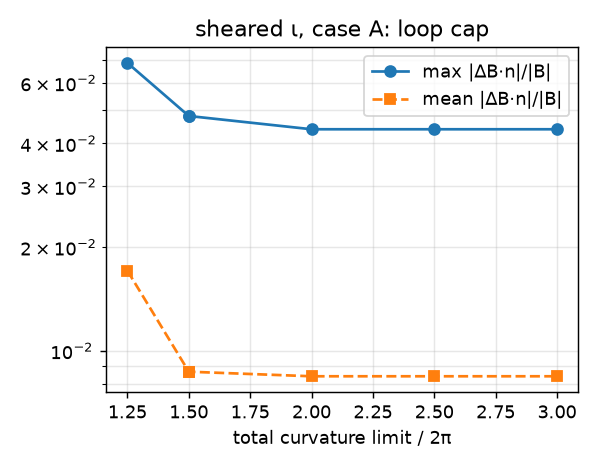

- **Loop cap (case A):** removing the cap lets the coils reach 1.87·2π, which improves the error
  by only 8%. Tightening it to 1.25·2π costs 1.4–2×. A's 4–5% floor comes from the equilibrium
  (ι ≈ 5.7), not from the coil limits.

## Validation

**Field lines.** `validate_fieldlines.py` traces field lines of B + (B_coils,ESSOS − B_coils,exact)
for case D. The plasma currents are held at their analytic values, and the coil-field error is
tabulated against the exact interior field and fitted smoothly. The traced lines stay on nested
surfaces 1.0–3.5 mm (mean) from the analytic ones, 7.5 mm at most, from ρ = 0.2 to 0.8, with no
islands. ι changes by 0.08%.

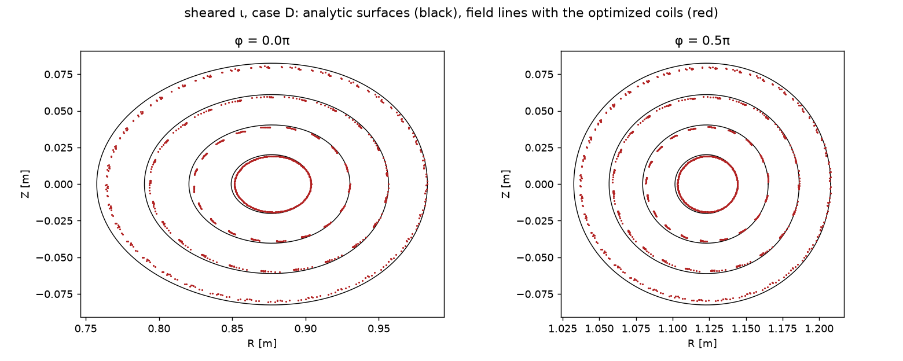

**VMEX.** `benchmark_vmex.py` gives VMEX the analytic profiles: toroidal flux, pressure p(s) and
enclosed current I(s). It runs a fixed-boundary solve on the exact boundary and a free-boundary
solve with only the coils.

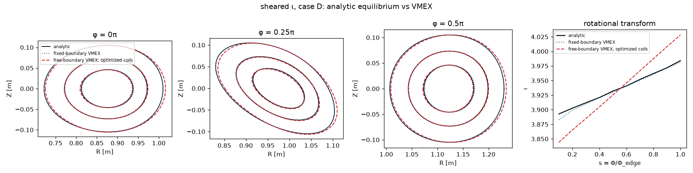

| case D | boundary deviation mean / max | ι error | residual |
| --- | --- | --- | --- |
| fixed boundary (exact boundary) | 0.08 / 0.15 mm | 0.26% | 1.1e-9 |
| free boundary (coils), quasi-stationary state | 2.7 / 6.3 mm | 1.3% | 2.5e-4, not converged |

- Fixed-boundary VMEX reproduces the analytic equilibrium. Case E converges to 1.7e-10, 0.16 mm
  and 0.3%.
- Free-boundary VMEX settles within millimetres of the analytic boundary, consistent with the field
  lines, but it never converges. The plasma drifts radially. VMEC2000 does the same on the same
  input.
- The coils' vertical field has decay index n = −(R/B_Z) ∂B_Z/∂R = 2.4–8.9 at the axis, above the
  3/2 limit for radial stability of a current-carrying plasma. The coils match the exact external
  field to 1%, so this index belongs to the equilibrium. These ~300 kA equilibria have no stable
  radial position, and VMEC, an energy minimizer, cannot settle on them.
- [uwplasma/vmex#570](https://github.com/uwplasma/vmex/pull/570) adds vertical-field position
  control. It removes the radial drift in case E and reaches residual 5e-8, but a helical axis
  displacement then grows.
- ι = 2 is not benchmarked: with ι exactly 2 everywhere, every field line closes on itself, and
  VMEC cannot converge to that with pressure.

VMEC sign conventions matter here. PHIEDGE must be +Φ (B along +φ) and curtor +I. VMEC2000 stops
on the wrong sign; VMEX did not, which [uwplasma/vmex#571](https://github.com/uwplasma/vmex/pull/571)
fixes. NZETA must be at least 2·NTOR + 4.

## Reproducing

| result | command | time (laptop CPU) |
| --- | --- | --- |
| coils, penalty | `python optimize_coils_iota2.py`, `python optimize_coils_sheared_iota.py` (`CASE`) | 1–2 min each |
| coils, augmented Lagrangian | the `*_augmented_lagrangian.py` scripts | 7–15 min each |
| parameter scans | `python scan_coils.py` | about 1.5 h |
| VMEX benchmark | `python benchmark_vmex.py` | about 20 min |
| field lines | `python validate_fieldlines.py` | about 15 min |

Peak memory is about 10 GB, mostly in the virtual-casing step. Run the scripts one at a time on a
24 GB machine.

## Upstream fixes

- **virtual_casing_jax**: left-handed (φ, θ) grids inflated the singular quadrature about 2500×.
  Fixed in [uwplasma/virtual_casing_jax#19](https://github.com/uwplasma/virtual_casing_jax/pull/19),
  released in 0.0.10.
- **ESSOS**: the augmented Lagrangian capped every inner solve at 50 iterations. Fixed in
  [uwplasma/ESSOS#147](https://github.com/uwplasma/ESSOS/pull/147), which brought ι = 2 from 1.5e-3
  to 3.4e-4 mean boundary error. Inequality constraints are unsupported
  ([uwplasma/ESSOS#145](https://github.com/uwplasma/ESSOS/issues/145)), so limits are written as
  equalities on their violation. [uwplasma/ESSOS#158](https://github.com/uwplasma/ESSOS/pull/158)
  adds a virtual-casing coil example.
- **VMEX**: wrong-sign PHIEDGE check
  ([uwplasma/vmex#571](https://github.com/uwplasma/vmex/pull/571)) and free-boundary position
  control ([uwplasma/vmex#570](https://github.com/uwplasma/vmex/pull/570)).

## Reference

M. Landreman, *Analytic toroidal 3D MHD equilibria and steady Euler flows with invariant
surfaces*, [arXiv:2609.26742](https://arxiv.org/abs/2609.26742);
scripts at [landreman/analytic_3d_equilibria](https://github.com/landreman/analytic_3d_equilibria).
