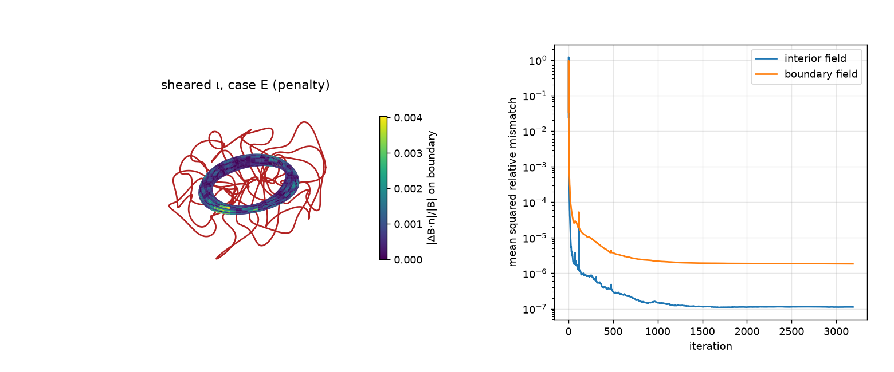
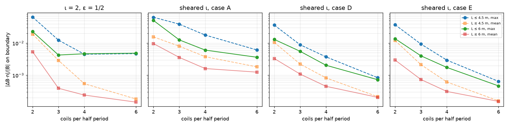
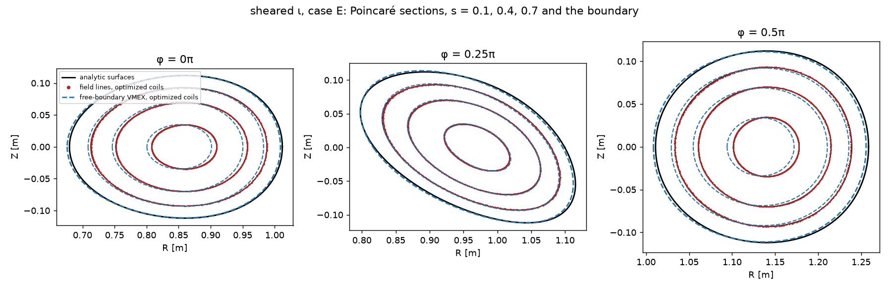
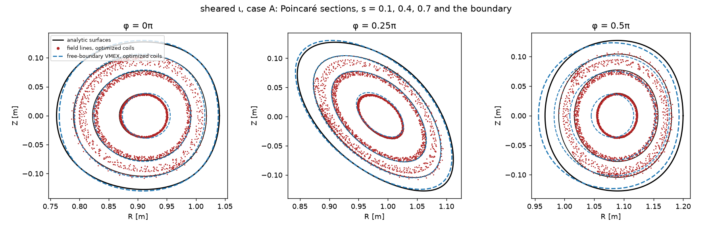
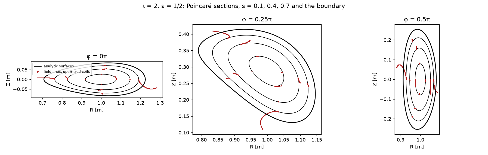
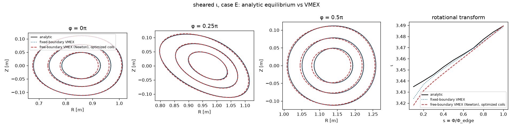

# coils-for-new-landreman

Coils, optimized with [ESSOS](https://github.com/uwplasma/ESSOS), for the explicit
non-axisymmetric MHD equilibria of [Landreman, arXiv:2609.26742](https://arxiv.org/abs/2609.26742),
and a check that they hold those equilibria.

The paper gives two families of smooth equilibria with exact nested flux surfaces in closed form:
one with rotational transform ι = 2, and one with sheared ι. Both have two field periods,
stellarator symmetry, finite pressure and net toroidal current. Here both families are written in
JAX, so the equilibrium and all its derivatives are known exactly. Virtual casing turns that
solution into the field the coils must produce. Coils are optimized for it with weighted penalties
or an augmented Lagrangian, then checked against VMEX and by field-line tracing.

 

## Usage

```bash
pip install -r requirements.txt
python optimize_coils_iota2.py                              # ι = 2, weighted penalties
python optimize_coils_iota2_augmented_lagrangian.py         # ι = 2, augmented Lagrangian
python optimize_coils_sheared_iota.py                       # sheared ι, CASE = "A", "B", "D" or "E"
python optimize_coils_sheared_iota_augmented_lagrangian.py  # sheared ι, augmented Lagrangian
python scan_coils.py                                        # coil count / curvature / length / loop-cap scan
python scan_fewer_coils.py                                  # 2-4 coils per half period at the final limits
python benchmark_vmex.py                                    # fixed- and free-boundary (Newton) VMEX vs the analytic solution
python validate_fieldlines.py                               # field lines with the coils vs the analytic surfaces
pytest -q                                                   # machine-precision checks of the equilibria
```

Every script runs on its own and prints its progress. The optimizations write
`coils_<case>.json` (ESSOS coils), `coils_<case>.png` (coils on the boundary coloured by the
B·n error, plus convergence) and `coils_<case>.gif` (the optimization).

| file | content |
| --- | --- |
| `landreman_equilibria.py` | both families in JAX, the cases, the exact boundary, the exact interior coil field, the boundary target |
| `coil_optimization.py` | targets, objective terms, constraints, penalty optimizer, report, figure and movie |
| `optimize_coils_*.py` | one script per family and method |
| `scan_coils.py` | parameter scans (`scan_results.json`, `scan.png`, `scan_loop_cap.png`) |
| `scan_fewer_coils.py` | 2–4 coils per half period at the final limits (`scan_fewer_results.json`, `scan_fewer.png`) |
| `benchmark_vmex.py` | VMEX benchmark (`benchmark_<case>.png`, `benchmark_results.json`, `wout_free_<case>.nc`) |
| `vmex_newton.py` | free-boundary VMEX by Newton, with a count of unstable ideal-MHD modes |
| `validate_fieldlines.py` | Poincaré sections with the coils vs analytic and free-boundary surfaces (`fieldlines_<case>.png`) |
| `tests/test_equilibria.py` | div B = 0, J × B = ∇p, B·∇ψ = 0, B·n = 0 on the boundary, ι(0) from the paper, vacuum coil field |

## Equilibria

| case | parameters | ι axis → edge | \|B\|max/\|B\|min on boundary | note |
| --- | --- | --- | --- | --- |
| ι = 2 | ε = 1/2, ψ_edge = 1/64 (paper fig. 1) | 2 | 1.6 | non-planar axis, closed field lines |
| sheared A | ε, S, k_b, λ = 1.08, 3, 0.7, 3.5 (paper fig. 2) | 5.69 → | 1.6 | nearly circular axis |
| sheared B | 4, 3.5, 0.7, 3.5 (paper fig. 2) | 4.36 → | 5.4 | not reproducible by coils |
| sheared D | 1, 2, 0.5, 3.5 (new) | 3.88 → 3.98 | 1.6 | elliptical axis, b/a = 1.28 |
| sheared E | 1, 1.75, 0.5, 3.5 (new) | 3.43 → 3.49 | 1.7 | like D, ι away from the ι = 4 resonance |

All cases are scaled to a 1 m mean axis radius and 1 T on the axis.

The sheared family is built on confocal ellipses whose foci, (x, y) = (0, ±√ε), are singularities
of the field. In paper cases B and C the foci lie about 0.2 m inside the plasma's outer edge, and
|B| on the boundary varies 5–12×. No coil set tried for B gets below 5% mean B·n error. Cases D
and E were found by scanning (ε, S, k_b, λ) for parameters that keep the foci away from the plasma
while keeping an elliptical axis and sheared ι.

## Method

**Exact coil field.** The plasma carries current, so the coils must reproduce only the field of the
currents outside it, B_coils = B − B_plasma. For points inside the plasma, virtual casing gives it
exactly:

    B_coils(x) = -(1/4π) ∮ (n' × B') × (x - x') / |x - x'|³ dA'

The boundary r(θ, ζ) and B are analytic, so the trapezoidal rule converges exponentially. At half
the minor radius the target is accurate to 2e-15 (sheared cases) and 1.4e-8 (ι = 2). On the
boundary itself the integral is singular. There, the on-surface singular quadrature of
[virtual_casing_jax](https://github.com/uwplasma/virtual_casing_jax) gives all three components.
A 32 × 32 grid at 4 digits is converged to about 1e-6 of |B|.

**Objective.** The coils must match:
- the interior field, which fixes the total coil current;
- the full boundary field: the normal part for B·n = 0, and the tangential part for the pressure
  balance a free-boundary equilibrium needs.

The engineering limits are:
- length ≤ 6 m and curvature ≤ 5 m⁻¹;
- mean squared curvature ≤ 14 m⁻²;
- total curvature ∫κ dl ≤ 5π (each loop adds 2π);
- arclength variation;
- coil–coil distance ≥ 0.12 m and coil–plasma distance ≥ 0.2 m;
- zero linking number.

The coils start as circles, Fourier order 6: 3 per half period for ι = 2 and E, 4 for A and D
(see Fewer coils). For the sheared
cases they are centred on the elliptical axis. All gradients are exact (JAX).

**Methods.**
- *Penalty*: the limits are weighted penalties, minimized with L-BFGS-B (3000 iterations).
- *Augmented Lagrangian*: the field mismatch is the objective and each limit is a constraint,
  max(value − limit, 0) = 0, with its own multiplier (`essos.augmented_lagrangian`). It runs
  10 outer iterations of up to 400 inner L-BFGS-B iterations each. The augmented-Lagrangian
  scripts keep the earlier limits (5 coils, order 4, length 4 m, curvature 4 m⁻¹, total curvature
  3π), so they are compared with penalty runs at those limits.

## Results

Penalty method, final limits (length 6 m, curvature 5 m⁻¹, total curvature 5π, 3000 iterations,
about 10 min each):

| case | coils per half period | interior \|ΔB\|/\|B\| mean / max | boundary \|ΔB·n\|/\|B\| mean / max | boundary \|ΔB\|/\|B\| max | max κ (m⁻¹) |
| --- | --- | --- | --- | --- | --- |
| ι = 2 | 3 | 1.9e-4 / 4.8e-4 | 4.0e-4 / 4.3e-3 | 6.6e-2 | 5.01 |
| sheared A | 4 | 5.0e-4 / 1.1e-3 | 1.6e-3 / 6.0e-3 | 6.0e-3 | 5.05 |
| sheared D | 4 | 1.8e-4 / 4.5e-4 | 3.9e-4 / 1.8e-3 | 1.8e-3 | 5.01 |
| sheared E | 3 | 3.1e-4 / 7.2e-4 | 7.2e-4 / 4.0e-3 | 4.4e-3 | 5.02 |

| ι = 2 | sheared A |
| --- | --- |
|  |  |
| **sheared D** | **sheared E** |
|  |  |

Movies of every run: `coils_<case>.gif` and `coils_<case>_al.gif`.

- All four hold the boundary B·n to 0.6% or better with 12–16 coils in total. D holds it to 0.2%.
- Relaxing the limits, mainly the loop cap (3π → 5π total curvature) and the length (4 → 6 m),
  is what allows so few coils. Fewer coils still cost some accuracy: 6 coils per half period at
  4.5 m reach 0.07% for D and E (Fewer coils).
- For ι = 2, the boundary field error is 6.5% at a few points on the inboard midplane near φ = 0,
  where |B| is highest, for every coil set tried, including 6 coils. The target there is converged to 1e-6, so it is
  a limit of the coils, not of the target. Elsewhere it is below 0.5%.
- Coil forces are reported, not penalized.

**Augmented Lagrangian vs penalty**, at the earlier limits (5 coils, order 4, length 4 m,
curvature 4 m⁻¹, total curvature 3π, penalty 1000 iterations):

| case | method | interior mean / max | boundary B·n mean / max | max κ (m⁻¹) | time |
| --- | --- | --- | --- | --- | --- |
| ι = 2 | penalty | 3.4e-4 / 9.3e-4 | 6.2e-4 / 4.7e-3 | 4.02 | 94 s |
| ι = 2 | augmented Lagrangian | 2.7e-4 / 8.6e-4 | 5.4e-4 / 4.6e-3 | 4.00 | 430 s |
| sheared A | penalty | 3.9e-3 / 9.8e-3 | 8.7e-3 / 4.8e-2 | 4.56 | 65 s |
| sheared A | augmented Lagrangian | 4.9e-3 / 1.0e-2 | 1.2e-2 / 5.2e-2 | 4.01 | 854 s |
| sheared D | penalty | 1.2e-3 / 2.5e-3 | 3.1e-3 / 9.2e-3 | 4.09 | 62 s |
| sheared D | augmented Lagrangian | 1.2e-3 / 3.0e-3 | 3.2e-3 / 9.7e-3 | 4.00 | 867 s |

The augmented Lagrangian meets every limit exactly and matches the penalty field error for ι = 2
and D, but takes 5–14× longer. Figures: `coils_<case>_al.png`.

## Parameter scan

`scan_coils.py` runs the penalty optimization (500 iterations, 5-coil order-4 limits) for:
- every combination of 3–6 coils per half period, curvature limit 3–5 m⁻¹ and length limit
  3–5 m (108 runs);
- case A with total-curvature caps of 1.25–3·2π.


| case | 3 coils | 4 coils | 5 coils | 6 coils |
| --- | --- | --- | --- | --- |
| ι = 2 | 2.5e-2 | 6.3e-3 | 4.8e-3 | 4.8e-3 |
| sheared A | 5.8e-2 | 4.9e-2 | 4.8e-2 | 3.9e-2 |
| sheared D | 1.9e-2 | 1.3e-2 | 1.1e-2 | 9.4e-3 |

*Maximum boundary \|ΔB·n\|/\|B\|, curvature ≤ 4 m⁻¹, length ≤ 4 m.*

- **Coils:** 5 per half period is within 1.24× of 6 in every case. Going to 4 costs up to 1.3×,
  and 3 costs 1.2–5×.
- **Length:** going from 3 to 4 m cuts the error 1.1–5.4×. 5 m helps mainly with 3 coils
  (1.5–2.9×).
- **Curvature:** 4 m⁻¹ is enough; 5 m⁻¹ changes the error by at most 18%. 3 m⁻¹ costs up to
  7× with 3 m coils.


- **Loop cap (case A):** removing the cap lets the coils reach 1.87·2π, which improves the error
  by only 8% at 5 coils of order 4. Tightening it to 1.25·2π costs 1.4–2×. With 6 coils of order
  6 the extra freedom pays off: A drops from 4.8% to 0.6% maximum B·n error (Results above), so
  A's earlier floor was set by the coil limits, not by the equilibrium.

### Fewer coils

`scan_fewer_coils.py` repeats the final optimization (order 6, curvature ≤ 5 m⁻¹, total curvature
≤ 5π, 1500 iterations) with 2–4 coils per half period. It lets the coils grow to 4.5 m or 6 m.



| case | 2 coils, 6 m | 3 coils, 6 m | 4 coils, 6 m | 6 coils, 4.5 m |
| --- | --- | --- | --- | --- |
| ι = 2 | 2.3e-2 | 4.3e-3 | 4.7e-3 | 4.7e-3 |
| sheared A | 5.1e-2 | 1.3e-2 | 6.1e-3 | 6.1e-3 |
| sheared D | 1.3e-2 | 5.6e-3 | 2.0e-3 | 8.4e-4 |
| sheared E | 1.4e-2 | 4.0e-3 | 1.7e-3 | 6.4e-4 |

*Maximum boundary \|ΔB·n\|/\|B\|.*

- **ι = 2:** 3 coils per half period (12 in total) at 6 m match 6 coils. The maximum is set by the
  inboard spot.
- **A:** 4 coils at 6 m (16 in total, 96 m of conductor) match 6 coils at 4.5 m (24 coils, 108 m).
- **D and E:** each coil removed costs about 2.5×. 4 coils at 6 m still hold B·n to 0.2%, and 3
  coils to 0.4–0.6%.
- With 2 coils no case gets below 1%.
- Longer coils matter more as the coil count drops. At 3 coils, going from 4.5 m to 6 m gains
  1.6–3×.

The coils of every point are saved as `scan_fewer_<case>_<n>_<length>.json`.

## Validation

**Field lines.** `validate_fieldlines.py` traces field lines of B + (B_coils,ESSOS − B_coils,exact).
The plasma currents are held at their analytic values. The coil-field error is tabulated against the
exact interior field (accurate to 1e-11 or better) and fitted smoothly. Each figure overlays three
things: the analytic surfaces (black), the traced field lines (red) and the free-boundary VMEX
surfaces with the same coils (blue dashed).

| case | coils per half period | field lines from analytic surfaces, mean / max |
| --- | --- | --- |
| sheared A | 4 | 4.4 / 23 mm |
| sheared D | 4 | 1.0 / 4.8 mm |
| sheared E | 3 | 0.60 / 2.2 mm |

| | |
| --- | --- |
|  |  |
|  |  |

- For D and E the field lines lie on the analytic surfaces to within a few mm, with no islands.
- For A, the lines near s = 0.7 spread into a band a few cm wide. A has high ι (≈ 5.7) and
  β ≈ 20%, so the remaining 0.1% field error resonates more strongly there.
- ι = 2 has closed field lines on every surface, so any error breaks the surfaces into short arcs.
  This is expected. Lines started on the boundary leave it (up to 10 cm).
- With 6 coils per half period the field lines were 0.6 mm (D and E) from the analytic surfaces:
  the extra coils buy sub-mm field lines, not a visible change in the sections.

**VMEX.** `benchmark_vmex.py` gives VMEX the analytic profiles: toroidal flux, pressure p(s) and
enclosed current I(s). It runs a fixed-boundary solve on the exact boundary and a free-boundary
solve with only the coils.



| case | fixed boundary: deviation mean / max, ι error | free boundary (Newton): deviation mean / max, ι error | unstable modes |
| --- | --- | --- | --- |
| sheared A | 0.47 / 0.87 mm, 0.28% | 3.8 / 11.1 mm, 0.40% | 8 |
| sheared D | 0.08 / 0.15 mm, 0.26% | 2.7 / 6.1 mm, 0.40% | 8 |
| sheared E | 0.09 / 0.16 mm, 0.31% | 2.6 / 3.6 mm, 0.49% | 6 |

Figures for the other cases: `benchmark_A.png`, `benchmark_D.png`.

- Fixed-boundary VMEX reproduces the analytic equilibria.
- Free-boundary VMEX converges (|F| ≈ 2e-13) within a few mm of the analytic boundary, and ι is
  within 0.5%. The coil field lines stay closer than that. The difference is a coherent shift, not
  a resolution effect: for D with 6 coils, a 256 × 256 mgrid or 64 toroidal planes change it by
  under 2% (3.03 → 3.02 mm mean, 6.45 → 6.34 mm max), with the same unstable modes. Free boundary
  amplifies small field errors along the unstable directions.
- The free-boundary shift barely depends on the coil count once the coils are good enough:

  | case | 3 coils | 4 coils | 6 coils |
  | --- | --- | --- | --- |
  | sheared D | 3.7 / 9.9 mm | **2.7 / 6.1 mm** | 3.0 / 6.4 mm |
  | sheared E | **2.6 / 3.6 mm** | 2.6 / 5.1 mm | 2.6 / 4.9 mm |

  *Free-boundary boundary deviation, mean / max. Bold: the default.* With 3 coils D's surfaces
  visibly shift (about 1 cm at φ = 0), so D uses 4. E is as good with 3. A needs 4 to get B·n
  below 1%. ι = 2 is not benchmarked; its 3 coils match 6 in B·n.
- These equilibria are ideal-MHD unstable. The coils' vertical field has decay index
  n = −(R/B_Z) ∂B_Z/∂R up to 2.5–9.5 at the axis, above the 3/2 limit for radial stability of a
  ~300 kA plasma. The coils match the external field closely, so this index belongs to the
  equilibrium. The Newton solve finds 6–8 directions with δW < 0, including the radial shift.
- [uwplasma/vmex#570](https://github.com/uwplasma/vmex/pull/570) adds vertical-field position
  control. It removes the radial drift in case E, but a helical axis displacement then grows.
- ι = 2 is not benchmarked: with ι exactly 2 everywhere, every field line closes on itself, and
  VMEC cannot converge to that with pressure.

**Newton vs descent.** VMEX's default solver is steepest descent on the MHD energy, and it should
stay the default. It is robust from a cold start, compiles fast and uses little memory. It cannot
settle on an unstable equilibrium, though: these free-boundary runs drift instead of converging.
`vmex_newton.free_boundary_newton(inp, coils, grid)` takes over in that case:
1. It runs descent on the fixed-boundary problem, to about 3e-9.
2. It solves the free-boundary force balance by Newton: a Krylov anchor, then dense damped steps.
3. It reaches |F| ≈ 1e-13 and returns the wout.
4. From the eigenvalues of the force Jacobian it returns the number of unstable modes and their
   (m, n).

Use it when a free-boundary solve stalls, or when you need residuals far below 1e-10. Always start
it from a converged descent state; from cold, or from 1e-4, it is fragile. It costs 14–52 s of
compile time and 1.5–3× the memory. Its converged equilibrium may be a saddle of the MHD energy,
so check the returned unstable-mode count.

VMEC sign conventions matter here. PHIEDGE must be +Φ (B along +φ) and curtor +I. VMEC2000 stops
on the wrong sign; VMEX did not, which [uwplasma/vmex#571](https://github.com/uwplasma/vmex/pull/571)
fixes. NZETA must be at least 2·NTOR + 4.

## Reproducing

| result | command | time (laptop CPU) |
| --- | --- | --- |
| coils, penalty | `python optimize_coils_iota2.py`, `python optimize_coils_sheared_iota.py` (`CASE`) | about 10 min each |
| coils, augmented Lagrangian | the `*_augmented_lagrangian.py` scripts | 7–15 min each |
| parameter scans | `python scan_coils.py`, `python scan_fewer_coils.py` | about 1.5 h, about 3 h |
| VMEX benchmark | `python benchmark_vmex.py` | about 30 min |
| field lines | `python validate_fieldlines.py` | about 1.5 h (4 cases) |

Peak memory is about 10 GB, mostly in the virtual-casing step. Run the scripts one at a time on a
24 GB machine.

## Upstream fixes

- **virtual_casing_jax**: left-handed (φ, θ) grids inflated the singular quadrature about 2500×.
  Fixed in [uwplasma/virtual_casing_jax#19](https://github.com/uwplasma/virtual_casing_jax/pull/19),
  released in 0.0.10.
- **ESSOS**: the augmented Lagrangian capped every inner solve at 50 iterations. Fixed in
  [uwplasma/ESSOS#147](https://github.com/uwplasma/ESSOS/pull/147), which brought ι = 2 from 1.5e-3
  to 3.4e-4 mean boundary error. Inequality constraints are unsupported
  ([uwplasma/ESSOS#145](https://github.com/uwplasma/ESSOS/issues/145)), so limits are written as
  equalities on their violation. [uwplasma/ESSOS#158](https://github.com/uwplasma/ESSOS/pull/158)
  adds a virtual-casing coil example.
- **VMEX**: wrong-sign PHIEDGE check
  ([uwplasma/vmex#571](https://github.com/uwplasma/vmex/pull/571)) and free-boundary position
  control ([uwplasma/vmex#570](https://github.com/uwplasma/vmex/pull/570)).

## Reference

M. Landreman, *Analytic toroidal 3D MHD equilibria and steady Euler flows with invariant
surfaces*, [arXiv:2609.26742](https://arxiv.org/abs/2609.26742);
scripts at [landreman/analytic_3d_equilibria](https://github.com/landreman/analytic_3d_equilibria).
