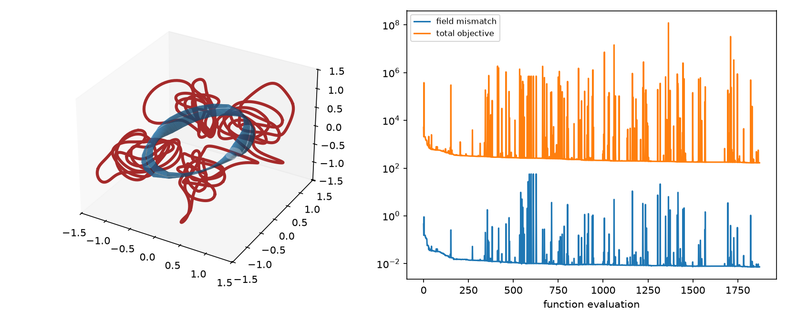

# coils-for-new-landreman

Coils for the explicit non-axisymmetric MHD equilibria of
[Landreman, arXiv:2609.26742](https://arxiv.org/abs/2609.26742), optimized with
[ESSOS](https://github.com/uwplasma/ESSOS).

The paper gives two families of smooth equilibria with exact nested flux surfaces in
closed form: one with uniform rotational transform ι = 2, and one with sheared ι. Both have two field
periods, stellarator symmetry and finite pressure. Here both families are written in JAX,
so the field, current, pressure and surfaces are differentiable in position and in the
family parameters. Coils are then found that reproduce the exact vacuum part of each field.

## Usage

```bash
pip install -r requirements.txt
python optimize_coils_iota2.py          # iota = 2 family, paper figure 1 (eps = 1/2)
python optimize_coils_sheared_iota.py   # sheared family, CASE = "A", "B" or "C" (paper figure 2)
pytest -q                               # machine-precision checks of the equilibria
```

Each script runs on its own: imports, input parameters, setup, a verbose optimization,
then results. It writes `coils_*.json` (ESSOS format) and `coils_*.png` (coils on the
plasma boundary, plus the convergence history).

## Files

| file | content |
| --- | --- |
| `landreman_equilibria.py` | both families in JAX (`iota2_B/psi/surface`, `sheared_B/psi/surface/iota_axis`), the exact boundary, the exact coil-field target `coil_field`, and a Fourier fit `fit_surface` for plotting |
| `optimize_coils_iota2.py` | coils for the ι = 2 family |
| `optimize_coils_sheared_iota.py` | coils for the sheared-ι family |
| `tests/test_equilibria.py` | div B = 0, J × B = ∇p, B · ∇ψ = 0, B · n = 0 on the boundary, ι(0) from the paper, and a check that the coil-field target is curl- and divergence-free |

## Method

**Exact coil-field target.** The plasma carries current, so the coils must not reproduce the
total field B. They must reproduce the field B_coils of the currents outside the plasma.
Virtual casing turns the boundary current K = n × B into an exact expression for B_coils at
any interior point x:

    B_coils(x) = -(1/4π) ∮ (n' × B') × (x - x') / |x - x'|³ dA'

The analytic solution supplies B and the boundary parameterization r(θ, ζ) exactly. The
integrand is smooth and periodic in (θ, ζ), so the trapezoidal rule converges exponentially
and reaches machine precision away from the boundary. The scripts match the coil field to
B_coils at half the minor radius (ψ = ψ_edge/4). They print an error bound for the target,
taken from the same quadrature at 2/3 resolution. For ι = 2 the boundary label is untwisted
(α = θ + 2ζ), which keeps the quadrature grid near-orthogonal. That reduces the cost by
more than an order of magnitude.

**Boundary B·n.** The interior formula is singular on the boundary itself. There,
`boundary_normal_target` uses the high-order on-surface virtual casing of
[virtual_casing_jax](https://github.com/uwplasma/virtual_casing_jax) (6 digits). It gives
the normal field the coils must supply on the exact plasma boundary.

**Coil optimization.** The coils start as circles, centred on the elliptical axis for the
sheared family, and use stellarator symmetry and two field periods. All gradients are exact
(JAX), the coil currents are free, and L-BFGS-B does the minimization. The objective
combines:

| term | role |
| --- | --- |
| `field` | exact interior coil field: fixes the total coil current and the poloidal circulation |
| `normal` | B·n on the exact boundary |
| `length`, `curvature`, `msc` | maximum length, curvature and mean squared curvature |
| `total_curvature` | ∫κ dl ≤ 3π: each loop adds 2π, so this prevents loops |
| `arclength` | arclength variation, as in SIMSOPT's ArclengthVariation |
| `coil_distance`, `surface_distance` | coil–coil (CurveCurveDistance) and coil–plasma distance |
| `linking` | linking number: no winding |

Coil forces are reported but not penalized.

## Results

Defaults: major radius 1 m, |B| = 1 T on the axis, 6 coils per half period (24 in total),
Fourier order 4, length ≤ 4 m, curvature ≤ 4 m⁻¹, total curvature ≤ 3π, 1000 iterations
(about 100–170 s on a laptop CPU).

| case | ι on axis | target error bound | interior mean / max \|ΔB\|/\|B\| | boundary mean / max \|ΔB·n\|/\|B\| | max κ (m⁻¹) | mean force (N/m) |
| --- | --- | --- | --- | --- | --- | --- |
| ι = 2, ε = 1/2 | 2 | 1.4e-8 | 1.1e-4 / 3.1e-4 | 2.6e-4 / 1.3e-3 | 4.0 | 9.7e4 |
| sheared, case A | 5.69 | 1.9e-15 | 3.0e-3 / 9.5e-3 | 7.8e-3 / 4.2e-2 | 4.4 | 7.9e4 |
| sheared, case B | 4.36 | 2.7e-10 | 7.8e-2 / 1.5e-1 | 6.6e-2 / 3.8e-1 | 7.8 | 1.1e6 |




**Parameter scan.** Five objective variants were run for each case, 500 iterations each:

- Matching the boundary B·n alone leaves the total current free. The interior error then
  grows to 19% (ι = 2), 370% (A) and 26% (B), so the interior field term is needed.
- Relaxing length to 4 m and curvature to 4 m⁻¹ improves ι = 2 and A by 2–4×. These are
  the defaults above.
- The total-curvature cap holds wherever it is set. With a 1.25·2π cap, the field error grows
  by about 25% (ι = 2) and only about 5% (A).
- A stronger coil–coil distance term changes nothing.

The ι = 2 coils have no closed loops, but they still bend sharply.

**Case B.** No combination of weights, limits, coil count (6 or 8), Fourier order (4 or 6)
or initial coil shape fixes case B. The cause is the equilibrium itself. The sheared family
is built on confocal ellipses whose singular foci lie at (x, y) = (0, ±√ε). In case B the
foci sit about 0.2 m inside the plasma's outer edge along the y axis, so |B| on the boundary
varies from 0.9 T to 5 T. In case C it varies from 1 T to 11 T. Coils kept at a practical
distance cannot reproduce that structure. Case A's foci are far from the plasma, and its
|B| varies only from 0.9 T to 1.4 T.

## Reference

M. Landreman, *Analytic toroidal 3D MHD equilibria and steady Euler flows with invariant
surfaces*, [arXiv:2609.26742](https://arxiv.org/abs/2609.26742);
scripts at [landreman/analytic_3d_equilibria](https://github.com/landreman/analytic_3d_equilibria).
